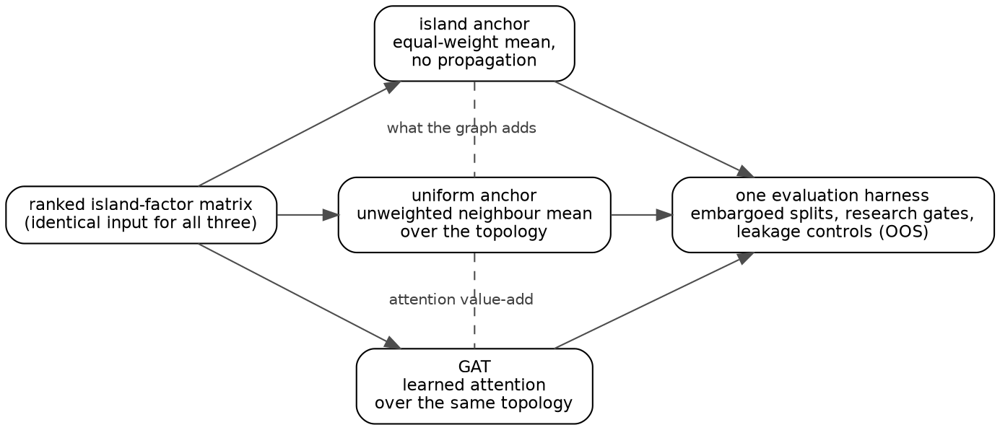
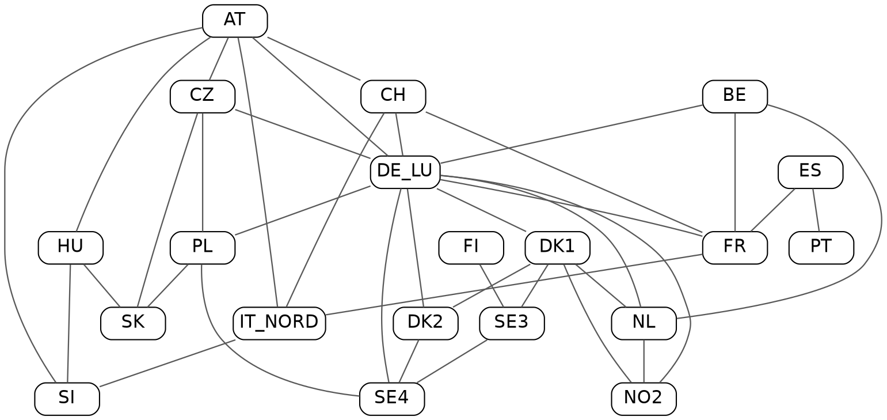
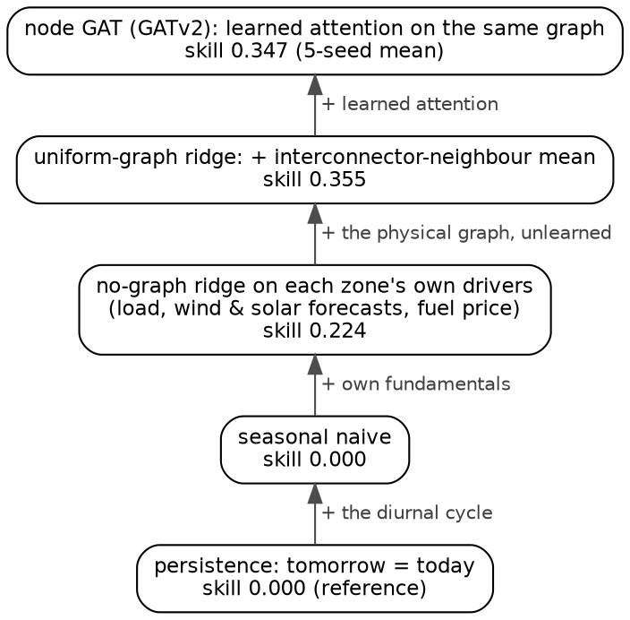

# 论文四张图的生成方式说明(详细版)

> 本文件仅供你本人参考,不属于论文交付物。写于 2026-07-06。
> 注意:`paper/` 目前整体未被 git 跟踪,但也**没有**被 .gitignore 忽略——
> 将来如果把 paper/ 提交或推送(比如推到 gat 仓库),这个文件会一起带上,
> 到时记得先删掉或移回 `.scratch/`。

---

## 1. 总览:从数据到 PDF 的完整流水线

```
数据源(三种)                     生成脚本                      中间产物 → 成品
──────────────                ──────────────────            ─────────────────────
src/.../edges_energy.py   ┐
  (EUROPEAN_INTERCONNECTORS)│
docs/results/               ├→  paper/scripts/gen_figures.py →  paper/figures/*.dot
  energy_forecast_node_     │        │                              │ (Graphviz 源,可检查)
  skill.csv                 │        │ subprocess 调用               ▼
docs/results/figures/       │        └─→ dot -K<engine> -Tpdf → paper/figures/*.pdf
  2026-06-11_attention_    ┘                                       │
  neighbour_weight.png ──────(直接复制,不经 Graphviz)──→ figures/att_neighbour_weight.png
                                                                    ▼
                                            main.tex 的 \includegraphics 嵌入,pdflatex 编译
```

设计原则与表格相同(claim ledger):**图里所有承载数据的东西——拓扑、
技能数值、时序曲线——都从仓库读取,脚本里没有一个手写的实验数字。**
概念图(图 4.1)是唯一例外,它不含数字,只是把方法章 §4.6 的文字结构
画出来。

构建接入点在 `paper/build.ps1`:

```powershell
py -3.13 scripts\gen_tables.py    # 表格(原有)
py -3.13 scripts\gen_figures.py   # 四张图(本次新增)
pdflatex -interaction=nonstopmode -halt-on-error main.tex
biber main
pdflatex ...; pdflatex ...
```

所以每次 `powershell -File build.ps1` 都会先重刷全部图表再编译,图和
数据源不会脱节。

---

## 2. 公共基础设施(gen_figures.py 头部)

```python
ROOT = Path(__file__).resolve().parents[2]        # 仓库根
FIG = ROOT / "paper" / "figures"                  # 所有输出落这里
sys.path.insert(0, str(ROOT / "src"))             # 让脚本能 import 项目包

from quant_alpha.graph.edges_energy import (      # 能源 GAT 实际用的常量
    EUROPEAN_BIDDING_ZONES,
    EUROPEAN_INTERCONNECTORS,
)

NODE_STYLE = 'shape=box, style=rounded, fontname="Helvetica", fontsize=11'
EDGE_STYLE = 'fontname="Helvetica", fontsize=10, color=gray30, fontcolor=gray25'


def render(name: str, dot_source: str, engine: str = "dot") -> None:
    src = FIG / f"{name}.dot"
    out = FIG / f"{name}.pdf"
    src.write_text(dot_source, encoding="utf-8")
    subprocess.run(
        ["dot", f"-K{engine}", "-Tpdf", str(src), "-o", str(out)],
        check=True,
        capture_output=True,
    )
    print(f"wrote figures/{name}.pdf  ({engine})")
```

要点:

- **先写 `.dot` 再渲 `.pdf`,两个都留在 `paper/figures/`**。`.dot` 是
  纯文本的 Graphviz 源,出问题时可以直接打开看、手工改了单独重渲;
  `.pdf` 是矢量图,LaTeX 里无级缩放不失真。
- `dot -K<engine>` 表示"用 dot 这个可执行文件,但切换布局引擎"。
  本项目用到两个引擎:**dot**(分层布局,适合有方向的流程/梯子)和
  **neato**(弹簧-电荷物理模拟布局,适合无向网络)。
- Graphviz 装在 `C:\Users\Administrator\Graphviz\bin\`(14.1.5,已在
  PATH),`subprocess.run(..., check=True)` 保证渲染失败时构建立刻报错
  而不是悄悄产出旧图。
- 字体用 Helvetica:论文正文是 Latin Modern(衬线),图内用无衬线是
  学术出版的常见惯例,而且 Helvetica 在 Windows 的 Graphviz 上一定可用
  (Latin Modern 对 Graphviz 不可见,指定了会静默回退)。

---

## 3. 图 4.1 `isolation_anchors.pdf` — 注意力 A/B 示意(§4.6)

**性质**:纯概念图,零数据。它画的是方法章已经用文字定义的结构,
给非金融背景的读者(导师)一眼看懂"三个模型、同一输入、同一评测、
两个边际量"。

### 生成代码(gen_figures.py)

```python
def isolation_anchors() -> None:
    dot = f"""digraph iso {{
  rankdir=LR;
  ranksep=0.55; nodesep=0.45;
  node [{NODE_STYLE}, margin="0.16,0.10"];
  edge [{EDGE_STYLE}];
  feat   [label="ranked island-factor matrix\\n(identical input for all three)"];
  island [label="island anchor\\nequal-weight mean,\\nno propagation"];
  unif   [label="uniform anchor\\nunweighted neighbour mean\\nover the topology"];
  gat    [label="GAT\\nlearned attention\\nover the same topology"];
  harn   [label="one evaluation harness\\nembargoed splits, research gates,\\nleakage controls (OOS)"];
  feat -> island; feat -> unif; feat -> gat;
  island -> harn; unif -> harn; gat -> harn;
  island -> unif [style=dashed, dir=none, constraint=false, label="what the graph adds"];
  unif -> gat    [style=dashed, dir=none, constraint=false, label="attention value-add"];
}}
"""
    render("isolation_anchors", dot)
```

### 生成出的 DOT 源(paper/figures/isolation_anchors.dot,全文)



### 关键属性解释

| 属性 | 作用 |
|---|---|
| `rankdir=LR` | 分层方向从左到右:输入 → 三模型 → 评测,自然形成三条平行通路 |
| `ranksep` / `nodesep` | 层与层、同层节点之间的间距(英寸) |
| `feat -> island; feat -> unif; feat -> gat` | dot 引擎自动把三个模型排成中间一列(同一 rank) |
| `style=dashed, dir=none` | 两条"比较边"画成无箭头虚线——它们表示的是差值比较,不是数据流 |
| `constraint=false` | **最关键的一个**:让虚线边不参与分层计算。没有它,dot 会试图把 island、unif、gat 排到不同层,整个"三条平行通路"的布局就毁了 |
| `label="what the graph adds"` | 虚线上的标签。措辞刻意与摘要一致("what a graph adds"),没有用词汇表之外的自造术语 |

### LaTeX 嵌入(sections/04_methodology.tex,§4.6 末尾)

```latex
\Cref{fig:iso-anchors} draws the arrangement: three factor
constructions, one input matrix, one harness.

\begin{figure}[htbp]
  \centering
  \includegraphics[width=0.88\textwidth]{isolation_anchors.pdf}
  \caption{The attention A/B. All three factor constructions read the
  same ranked island-factor matrix and are scored by the same
  evaluation harness; the two dashed comparisons are the quantities
  this report is about --- what the graph adds (island anchor versus
  uniform anchor) and what learned attention adds (uniform anchor
  versus GAT, the attention value-add).}
  \label{fig:iso-anchors}
\end{figure}
```

宽度 0.88\textwidth 是试出来的:够宽让 11pt 的节点文字在成品里可读,
又不至于顶满版心。实际排版效果:嵌在 §4.6 与 §4.7 之间的正文流里
(第 12 页),不占独立浮动页。

---

## 4. 图 5.1 `att_neighbour_weight.png` — 注意力邻居权重时序(§5.6)

**性质**:归档实验产物的原样复制,唯一一张非 Graphviz 图。

### 生成代码

```python
def attention_panel() -> None:
    src = ROOT / "docs" / "results" / "figures" / "2026-06-11_attention_neighbour_weight.png"
    dst = FIG / "att_neighbour_weight.png"
    shutil.copyfile(src, dst)
    print("wrote figures/att_neighbour_weight.png  (copied from archived E10 analysis)")
```

### 来龙去脉

- 原图是实验 **E10(注意力定性分析,2026-06-11)** 当时用 matplotlib
  画的五张归档图之一,画图脚本是 `.scratch/run_attention.py`,数据是
  代表性模型(static 图、IC loss、赢家超参、seed 0)在 1,364 个交易日
  上抽取的 919,336 行边权。五张图一直躺在
  `docs/results/figures/` 里,论文附录也声明了它们的存在。
- 为什么选这张(而不是 homophily/hubs/concentration/matrix):一张图
  同时佐证正文三个论断——①自环权重只有 0.084(91.6% 注意力在邻居上,
  证明注意力真的在用图);②0.91–0.92 窄带全程平稳(修正设计文档里
  "宏观状态自适应"的假设);③图中虚线(OOS →)前后无断裂(IS/OOS
  边界行为一致)。
- **复制而不是重画**:归档 PNG 是 claim ledger 里登记过的证据,原样
  引用比重画更硬;改名去掉日期前缀只是为了 LaTeX 引用路径干净。
- 若将来重跑 E10 更新了归档 PNG,重跑 build 自动同步到论文。

### LaTeX 嵌入(sections/05_equity.tex,§5.6 末尾)

```latex
\begin{figure}[htbp]
  \centering
  \includegraphics[width=\textwidth]{att_neighbour_weight.png}
  \caption{Attention mass placed on neighbours (one minus the
  self-loop weight) per snapshot over 2021--2026, from the archived
  attention analysis of the representative trained model. The share
  stays in a narrow band around 0.91--0.92, with no break at the
  dashed IS/OOS boundary --- the stationarity reported in the text.}
  \label{fig:att-neighbour}
\end{figure}
```

正文引用点在平稳性那句话末尾:
`...with no visible break at the IS/OOS boundary (\cref{fig:att-neighbour}).`

PNG 是位图(matplotlib 默认 DPI),满宽放置下打印足够清晰;若嫌不够,
以后可以改 run_attention.py 以 `dpi=200` 重导出归档图。

---

## 5. 图 6.1 `interconnector.pdf` — 20 区物理互联图(第 6 章开头)

**性质**:数据图。**拓扑不是画出来的,是从能源 GAT 实际使用的那份
参考常量导出的**——`src/quant_alpha/graph/edges_energy.py` 里的
`_BORDERS` 字典(20 个竞价区,谁和谁接壤/有 HVDC 电缆),它经
`_symmetric_pairs()` 变成 `EUROPEAN_INTERCONNECTORS`(38 个无向对),
GAT 建图、边级价差实验(38 条边界)用的都是它。

### 生成代码

```python
def interconnector() -> None:
    edges = sorted(tuple(sorted(pair)) for pair in EUROPEAN_INTERCONNECTORS)
    lines = [
        "graph interconnector {",
        '  graph [overlap=false, splines=true, sep="+7", start=5];',
        '  node [shape=box, style=rounded, fontname="Helvetica", fontsize=15,'
        ' margin="0.07,0.04", height=0.38];',
        "  edge [color=gray35, penwidth=1.1];",
    ]
    lines += [f'  "{z}";' for z in sorted(EUROPEAN_BIDDING_ZONES)]
    lines += [f'  "{a}" -- "{b}";' for a, b in edges]
    lines.append("}")
    render("interconnector", "\n".join(lines) + "\n", engine="neato")
    print(f"  ({len(EUROPEAN_BIDDING_ZONES)} zones, {len(edges)} interconnectors)")
```

两处 `sorted()` 不是洁癖:`frozenset` 迭代顺序在不同 Python 进程间
不稳定,不排序的话每次生成的 DOT 行序不同 → neato 布局跟着变 →
每次 build 图长得不一样。排序 + 固定种子(见下)保证**逐字节可重现**。

### 生成出的 DOT 源(paper/figures/interconnector.dot,全文 63 行)



(真实文件里节点和边各占一行;上面为省版面每行排了几个,内容一致。)

### 关键属性解释

| 属性 | 作用 |
|---|---|
| `graph`(不是 `digraph`)+ `--` | 无向图。电网互联没有方向 |
| 引擎 **neato**(`render(..., engine="neato")`) | 弹簧-电荷模拟:边当弹簧、节点互相排斥,迭代到能量最低。连接多的节点自然被拉到中间——**DE_LU(11 条边)居中成为枢纽不是我摆的,是物理布局自己收敛出来的**,而这正好就是论文想让读者看到的结构事实 |
| `start=5` | neato 初始随机布局的种子。固定它,布局才可重现(逐次 build 不跳动) |
| `overlap=false` | 布局收敛后如有节点盒子重叠,做一次去重叠后处理 |
| `splines=true` | 边画成绕开节点盒子的曲线,不从盒子上穿过 |
| `sep="+7"` | 去重叠时在每个节点外加 7pt 的缓冲,防止盒子贴边 |
| `fontsize=15`(比另两张图大) | 这张图缩放到 0.78\textwidth 时缩得最狠,字号要预先放大才能在成品里保持可读。第一版用 11pt,目检发现太小后调到 15 |

### LaTeX 嵌入(sections/06_energy.tex,章首段之后)

```latex
\begin{figure}[t]
  \centering
  \includegraphics[width=0.78\textwidth]{interconnector.pdf}
  \caption{The energy graph: 20 European bidding zones and their 38
  physical cross-border interconnections (land borders and HVDC
  cables), drawn from the repository's reference data. Unlike the
  equity correlation graph, nothing here is estimated --- the topology
  is the grid. DE\_LU, with eleven interconnectors, is the network's
  natural hub.}
  \label{fig:interconnector}
\end{figure}
```

浮动位置用 `[t]` 而不是默认的 `[htbp]`:第一版排版时 LaTeX 把它扔到
独立浮动页,下半页全空;`[t]` 强制"贴到某页顶部",正文(§6.2 的
三个 artifact 叙述)填满图下方,消掉了空白页。正文引用在章首段:
`\Cref{fig:interconnector} shows that graph as configured in the
repository --- twenty zones, 38 physical borders and HVDC links, ...`

**手动同步点**:图注里的 20 / 38 / eleven 是手写的。脚本每次运行会
打印 `(20 zones, 38 interconnectors)`,若以后 `_BORDERS` 改了,对照
打印值改图注(以及正文里的 "38 borders")。

---

## 6. 图 6.2 `energy_ladder.pdf` — 预测技能梯子(§6.5)

**性质**:概念结构 + 真实数值。梯子的"形状"(五档、每档加一种成分)
是方法章 §4.7 的文字;**每档的 skill 数值不是手写的,是运行时从
结果 CSV 读进标签的**——和表 6.2 同一个数据源,永远一致。

### 数据源(docs/results/energy_forecast_node_skill.csv,原文)

```csv
predictor,skill,rank_ic,note
persistence,0.000,0.637,reference (tomorrow = today)
seasonal_naive,0.000,0.637,diurnal carry
no_graph_ridge,0.224,0.636,own physical drivers (ridge)
uniform_graph_ridge,0.355,0.584,+ interconnector-neighbour mean (unlearned graph)
gat_node,0.347,0.612,learned attention (PyG GATv2; 5-seed mean)
gat_congestion,0.346,0.615,+ price-spread congestion edge feature (5-seed mean)
```

注意 `gat_congestion` **没有**画进梯子:它是"再加一个边特征"的变体
(结论为 null,表 6.2 里有),画进去会破坏"每档只加一种成分"的叙事。

### 生成代码

```python
def energy_ladder() -> None:
    rows = {
        r["predictor"]: r
        for r in csv.DictReader(
            (ROOT / "docs" / "results" / "energy_forecast_node_skill.csv").open(encoding="utf-8")
        )
    }

    def skill(predictor: str) -> str:
        return rows[predictor]["skill"]

    dot = f"""digraph ladder {{
  rankdir=BT;
  ranksep=0.3; nodesep=0.25;
  node [{NODE_STYLE}, margin="0.13,0.08"];
  edge [{EDGE_STYLE}];
  r0 [label="persistence: tomorrow = today\\nskill {skill('persistence')} (reference)"];
  r1 [label="seasonal naive\\nskill {skill('seasonal_naive')}"];
  r2 [label="no-graph ridge on each zone's own drivers\\n(load, wind & solar forecasts, fuel price)\\nskill {skill('no_graph_ridge')}"];
  r3 [label="uniform-graph ridge: + interconnector-neighbour mean\\nskill {skill('uniform_graph_ridge')}"];
  r4 [label="node GAT (GATv2): learned attention on the same graph\\nskill {skill('gat_node')} (5-seed mean)"];
  r0 -> r1 [label=" + the diurnal cycle"];
  r1 -> r2 [label=" + own fundamentals"];
  r2 -> r3 [label=" + the physical graph, unlearned"];
  r3 -> r4 [label=" + learned attention"];
}}
"""
    render("energy_ladder", dot)
```

### 生成出的 DOT 源(paper/figures/energy_ladder.dot,全文)



可以看到 `{skill('no_graph_ridge')}` 已被替换成 CSV 里的 `0.224` 等。

### 关键属性解释

| 属性 | 作用 |
|---|---|
| `rankdir=BT`(bottom-to-top) | dot 分层默认自上而下;BT 反过来,让"往上爬梯子 = 模型变强",persistence 在最底、GAT 在最顶 |
| 边标签 `" + own fundamentals"` 等 | 每支箭头一句话说明这一档**多加了什么**。r1→r2 这支就是给导师看的核心:太阳/风/负荷预报在 ridge 档进入,且之上所有档共享——图模型不多拿任何数据 |
| `ranksep=0.3; nodesep=0.25`(比图 4.1 紧) | 第一版 0.42 时整张图太高,被 LaTeX 排成独立浮动页;收紧后能和正文、表 6.3 同页 |

### LaTeX 嵌入(sections/06_energy.tex,§6.5,表 6.2 之后)

```latex
\begin{figure}[htbp]
  \centering
  \includegraphics[width=0.54\textwidth]{energy_ladder.pdf}
  \caption{The node-level forecast ladder of
  \cref{tab:energy-node-skill}, drawn as a ladder. Each rung adds
  exactly one ingredient, so each skill increment isolates one cause.
  The published drivers enter at the ridge rung and are shared by every
  rung above it; the graph's contribution ($+0.131$) enters below any
  learning.}
  \label{fig:energy-ladder}
\end{figure}
```

正文引用:`\Cref{tab:energy-node-skill} shows the node-level ladder,
and \cref{fig:energy-ladder} draws it with one added ingredient per
rung.`

**手动同步点**:图注里的 `+0.131`(= 0.355 − 0.224)是手写的;
CSV 数值变了要重新算并同步(图内数字会自动变,图注不会)。

---

## 7. LaTeX 侧的三处配套改动

1. **`main.tex` 导言区**:
   ```latex
   \pdfminorversion=7 % the Graphviz-generated figure PDFs are version 1.7
   ...
   \usepackage{graphicx}
   \graphicspath{{figures/}}
   ```
   - `\graphicspath{{figures/}}`:让 `\includegraphics{xxx.pdf}` 不用写
     目录前缀。
   - `\pdfminorversion=7`:Graphviz 输出的是 PDF 1.7,而 pdflatex 默认
     产出 PDF 1.5;不声明的话每张图都触发一条
     "found PDF version <1.7>, but at most version <1.5> allowed" 警告。
     声明后整份论文以 PDF 1.7 输出(任何现代阅读器都支持),警告消失。
2. **`build.ps1`** 加了一行 `py -3.13 scripts\gen_figures.py`(见 §1)。
3. **附录措辞**同步:"The report's build script regenerates the tables
   and figures from the repository's artifacts and reference data and
   then runs pdflatex and biber."

---

## 8. 操作手册

### 单独重新生成(不编译论文)

```powershell
cd D:\AI_Models\quant-alpha-foundation
py -3.13 paper\scripts\gen_figures.py
```

预期输出:

```
wrote figures/interconnector.pdf  (neato)
  (20 zones, 38 interconnectors)
wrote figures/isolation_anchors.pdf  (dot)
wrote figures/energy_ladder.pdf  (dot)
wrote figures/att_neighbour_weight.png  (copied from archived E10 analysis)
```

### 目检单页(不用打开整个 PDF)

```powershell
D:\MiKTeX\miktex\bin\x64\pdftoppm.exe -png -r 90 -f 18 -l 18 paper\main.pdf 输出前缀
```

(当前版本:图 4.1 在第 12 页,图 5.1 在第 16 页,图 6.1 在第 18 页,
图 6.2 在第 21 页;每次改动后页码可能漂移。)

### 改样式改哪里

| 想改什么 | 改哪里 |
|---|---|
| 字号、圆角、线宽、灰度 | `gen_figures.py` 的 `NODE_STYLE` / `EDGE_STYLE` / 各函数内联属性 |
| 图在论文里的大小 | 各章 `\includegraphics[width=...]`(现值:A/B 0.88、注意力满宽、互联 0.78、梯子 0.54) |
| 图的页面位置 | figure 环境的浮动说明符(互联图特意用 `[t]`,其余 `[htbp]`) |
| 布局本身(试验用) | 直接改 `paper/figures/*.dot` 后手动 `dot -Kneato -Tpdf x.dot -o x.pdf`;**但下次 build 会被脚本覆盖**,确定的改动要写回 gen_figures.py |

### 自动 vs 手动的边界(改数据后核对这张表)

| 上游变化 | 自动更新 | 需要手动同步 |
|---|---|---|
| `_BORDERS` 常量改动 | 图 6.1 的拓扑、脚本打印的计数 | 图 6.1 图注的 20/38/eleven;正文 "38 borders" |
| `energy_forecast_node_skill.csv` 更新 | 图 6.2 内的 5 个 skill 数值、表 6.2 | 图 6.2 图注的 +0.131;正文引用的 +0.131 |
| E10 归档 PNG 重导出 | 图 5.1 整张 | 图注里的 0.91–0.92 区间描述(若分布变了) |
| §4.6 文字定义改动 | — | 图 4.1 的 DOT 标签文字(概念图,全手写) |

### 一致性自检清单(改图前后各跑一次)

1. `py -3.13 paper\scripts\gen_figures.py` 的 zones/edges 打印值与
   图注、正文一致;
2. 图 6.2 数值 = `energy_forecast_node_skill.csv` = 表 6.2;
3. `py -3.13 .claude\skills\mpin-report\scripts\verify_paper.py paper\`
   零硬失败;
4. 重编译后用 pdftoppm 渲染四个图页逐一目检(布局、字号、无截断)。
